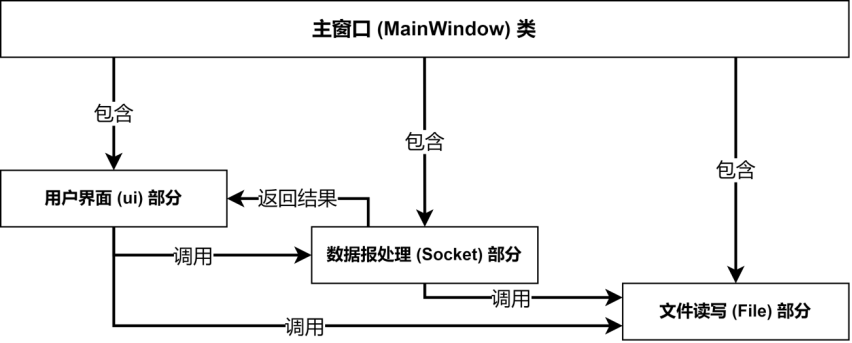
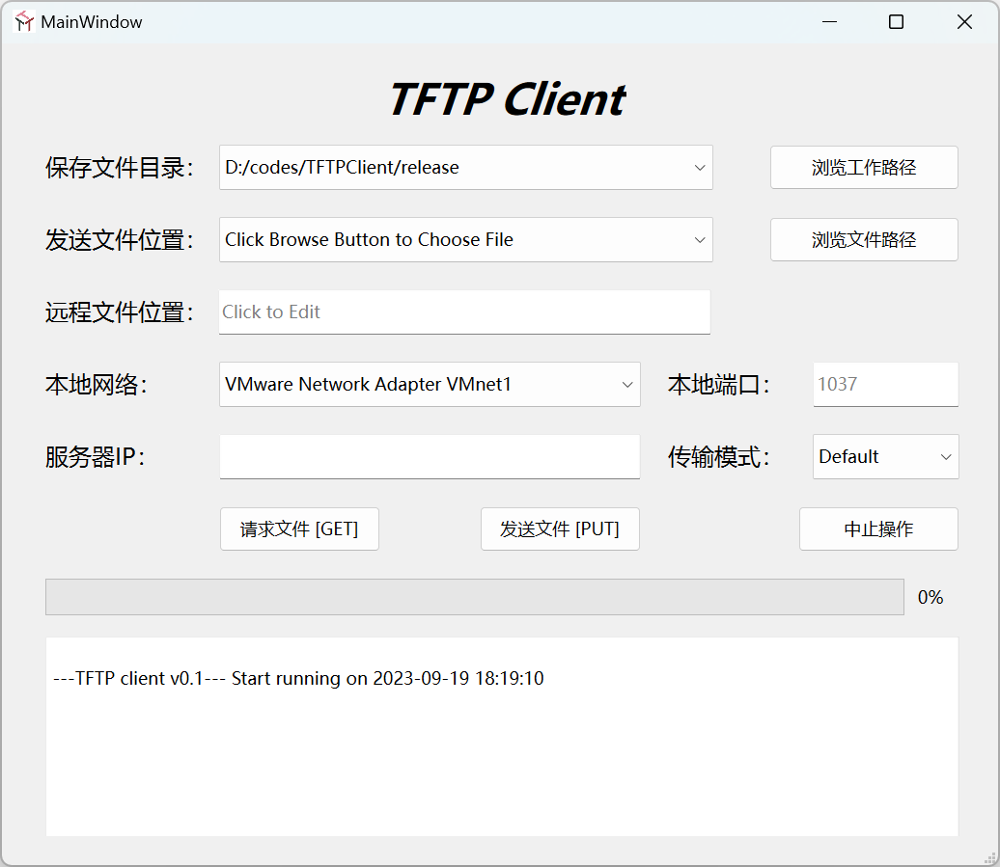

# Computer_Network_Experiment

*Wyywwi, 2023/10/10*

Wyywwi's computer network experiment source code, available for HUST CSE.

## Experiment Instructions

- [实验要求](./documents/网安-实验指导手册-计算机通信与网络-Socket编程.doc)
- [报告模板](./documents/计算机网络实验报告模板及要求-2021v4.doc)

## Enviroment

- Qt version: 6.5.2
- C++ 11
- MinGW 11.2.0 64-bit for C++
- Windows 11

## Architecture

1. Process Architecture Diagram
   

2. Client User Interface
   

## Additional Notes

To separate software packages that can be migrated and executed elsewhere, use `windeployqt` tool.

When transferring files between Windows and Linux (Unix, etc.), select the "octet" mode.